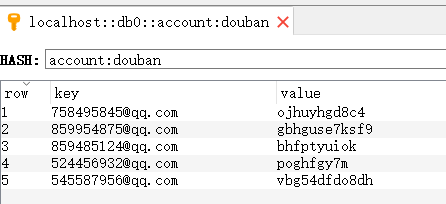
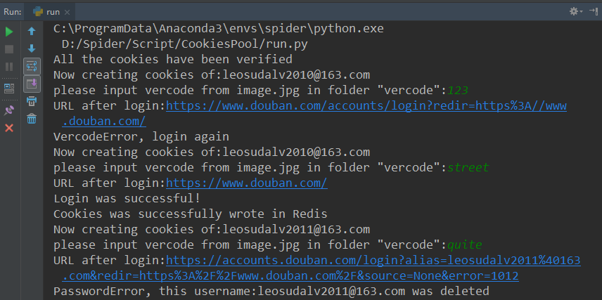

# Cookies pool management
This project aims at creating and managing a cookies pool for further simulating logining and scraping on douban.com.
## 1 Preparation
Make sure to install Python3.6, Chrome, ChromeDriver and Redis. 
Make sure to install the following libs: scrapy, selenium, requests, lxml and redis. 
## 2 Configuration
#### 2.1 Add Redis connenction parameters to settings.py

    HOST = 'localhost'
    PORT = 6379
    DB = 0
    PASSWORD = '123456'
    WEBSITE = 'douban'
#### 2.2 Set URLs
    LOGIN_URL = 'https://www.douban.com/accounts/'
    LOGINSUCCESS_URL = 'https://www.douban.com/'
    VERIFY_URL = 'https://www.douban.com/accounts/'
#### 2.3 Write account-password pairs into Redis
The account-password (key-value) pairs in RedisDestopManagener is like this as an example:

## 3 Connect to Redis
In redisdatabase.py, create class Redis to connect to Redis database and difine the methods to process account-password pairs and account-cookies pairs:

    class Redis(object):
        def __init__(self, category):
            self.category = category
            self.pool = ConnectionPool(host=HOST, port=PORT, db=DB, password=PASSWORD)
            self.redis = StrictRedis(connection_pool=self.pool)

        def name(self):
            # create the name of Redis hash mapping table
            # category should be 'account' or 'cookies'
            return '{}:{}'.format(self.category， WEBSITE)

        def write(self, key, value):
            self.redis.hset(self.name(), key, value)

        def read(self, key):
            return self.redis.hget(self.name(), key)
        
        def delete(self, key):
            self.redis.hdel(self.name(), key)

        def key_valued_pairs(self):
            return self.redis.hgetall(self.name())

## 4 Create cookies
In createcookies.py, load all the account-password pairs from Redis. If the account dosen't have a respective cookies yet, simulate logining via Selenium and fetch the cookies, then write the cookies back to Redis using json.dumps().

    def run(self):
        for pair in self.account_db.key_valued_pairs().items():
            username, password = pair
            if not self.cookies_db.read(username):
                self.execute(username.decode(), password.decode())
        self.driver.close()

When verification code is needed to be input while logining, download the vercode image, manually parse the vercode and then send it to the vercode_input element.

    def process_vercode(self):
        vercode_url = self.driver.find_element_by_xpath('//img[@id="captcha_image"]').get_attribute('src')
        headers = {'User-Agent': 'Mozilla/5.0'}
        response = requests.get(vercode_url, headers=headers)
        with open('vercode/image.jpg', 'wb') as f:
            f.write(response.content)
        vercode = input('please input vercode from image.jpg in folder "vercode":')
        vercode_input = self.driver.find_element_by_xpath('//input[@id="captcha_field"]')
        vercode_input.clear()
        vercode_input.send_keys(vercode)

## 5 Verify cookies
In verifycookies.py, load all the account-cookies pairs from Redis. Create a reqests session and add the cookies into the session, then visit the verify_url. If the visiting process is successful, the cookies is proved to be valid, otherwise delete the expired cookies.

    def run(self):
        for pair in self.cookies_db.key_valued_pairs().items():
            username, cookies = pair
            if cookies:
                self.verify(username.decode(), json.loads(cookies))

    def verify(self, username, cookies):
        print('Now verifying cookies of:{}'.format(username))
        headers = {
            'Host': 'www.douban.com',
            'User-Agent': 'Mozilla/5.0',
        }
        session = requests.Session()
        requests.utils.add_dict_to_cookiejar(session.cookies, cookies)
        response = session.get(self.verify_url, headers=headers)
        selector = etree.HTML(response.text)
        if not selector.xpath('//input[@value="更新设置"]'):
            print('Cookies of:{} is expired'.format(username))
            self.cookies_db.delete(username)
            print('Delete cookies of:{}'.format(username))
        else:
            print('Cookies of {} is valid'.format(username))

## 6 Running result
The screenshot when running run.py in PyCharm:

## 7 Summary
Create and manage cookies pool is very useful in many cases since cookies can help spider to avoid blocking from websites, let along some information can only be crawled after logining.  
In this project when simulaing logining to fetch cookies, the method to parse verification code is mannul and this pity can be changed by OCR technologies such as tesserocr. Multiprocessing can also be realized if automatically verification code parsing is enabled.
